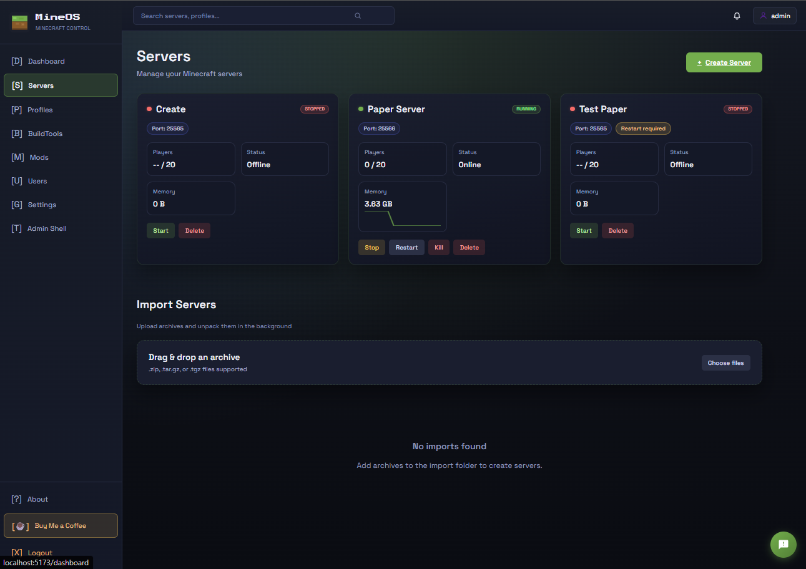
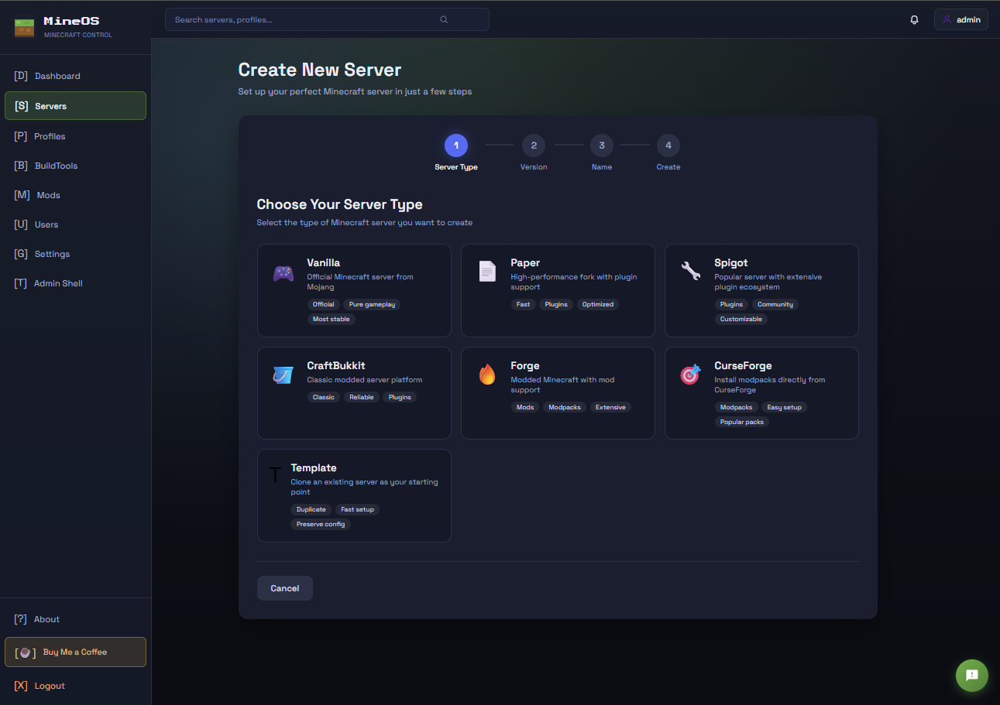
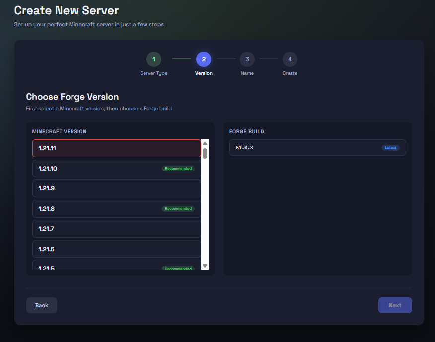
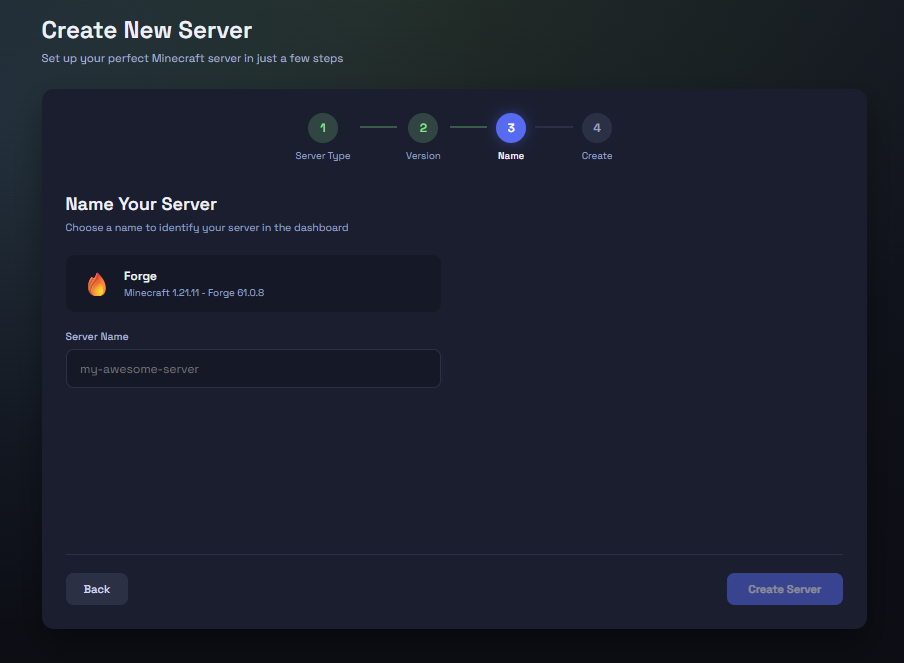
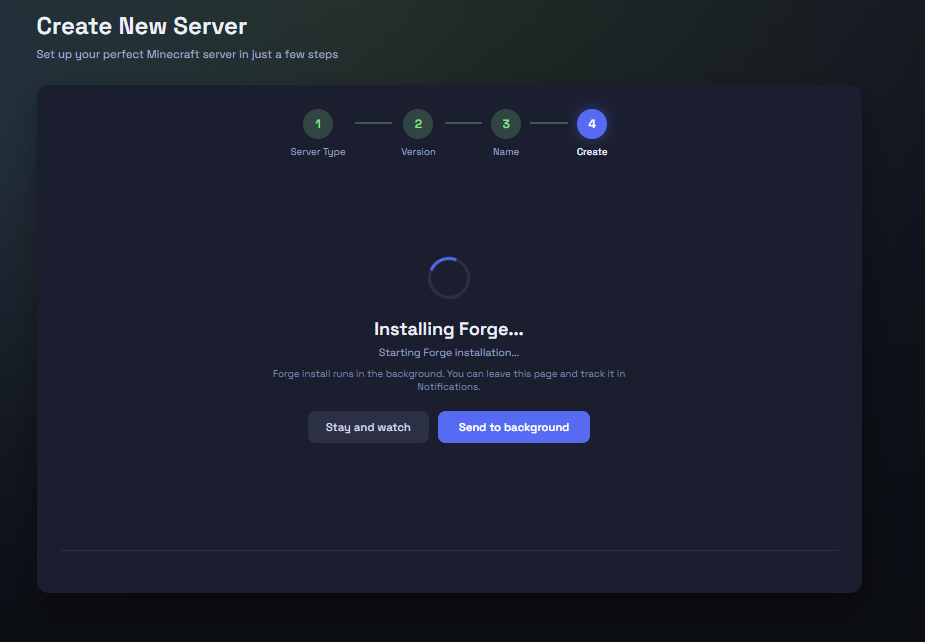
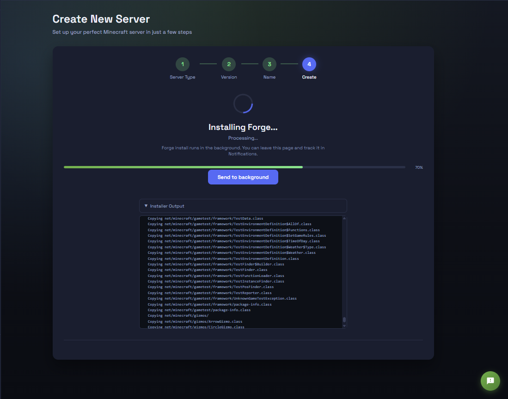
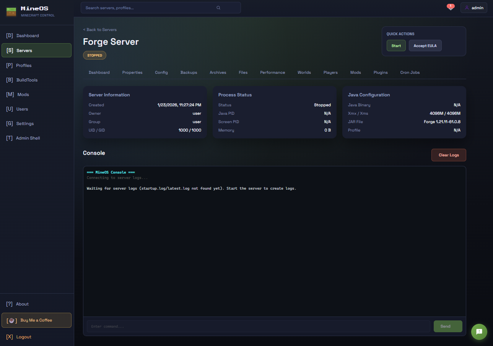

# MineOS - Minecraft Server Manager

A simple web interface to create and manage Minecraft servers. Run as many servers as you want, install mods with one click, and manage everything from your browser.

## MineOS Script (Setup + Management)

**What you need:**
- [Docker Desktop](https://www.docker.com/products/docker-desktop) (Windows/Mac) or Docker + Docker Compose (Linux)
- That's it!

**Run the script:**

**Windows:** Right-click `MineOS.ps1` -> Run with PowerShell

**Mac/Linux:** Open Terminal, run `./MineOS.sh`

The script can:
- Check Docker + Docker Compose
- Create all necessary files and folders
- Start/stop/restart MineOS
- Rebuild or update when needed

**Access MineOS:** Open [http://localhost:3000](http://localhost:3000) in your browser (served by the built-in reverse proxy)

## Script Usage

Once configured, use the MineOS script to manage services:

**Windows (PowerShell):**
- `MineOS.ps1` (interactive menu)
- `MineOS.ps1 -Dev` (API only + web dev env setup)

**Mac/Linux:**
- `./MineOS.sh` (interactive menu)
- `./MineOS.sh --dev` (API only + web dev env setup)

## That's It!

MineOS will start automatically whenever Docker starts. Create servers, install mods, and manage everything from the web interface.

## Uninstall

**Windows:** Run `uninstall.ps1`

**Mac/Linux:** Run `./uninstall.sh`

The uninstall script will ask if you want to keep your server data before removing anything.

## Where Are My Files?

- **Server data:** `./minecraft/` folder (all your Minecraft servers)
- **Database:** `./data/mineos.db` (MineOS settings)

## Troubleshooting

**Script won't run on Windows?**
Open PowerShell as Administrator and run:
```powershell
Set-ExecutionPolicy -Scope Process -ExecutionPolicy Bypass
```
Then try running `MineOS.ps1` again.

**Script won't run on Mac/Linux?**
```bash
chmod +x MineOS.sh uninstall.sh
```

**Need to change ports?**
Edit `.env` and run `docker compose restart`

## CI

**Manually run the Node.js CI workflow:**
1. GitHub → Actions → "Node.js CI"
2. Click "Run workflow" and choose the `main` branch.

**Want Minecraft LAN discovery?**
Re-run the setup script and enable **host networking**. This is Linux-only and disables Docker network isolation (containers bind directly to `API_PORT`/`WEB_PORT` on the host). The setup script automatically adds `docker-compose.host.yml` when needed.

## Demo Mode

Record demo data from a live instance:
```bash
cd apps/web
DEMO_API_BASE_URL=http://localhost:5078 DEMO_API_KEY=your-api-key npm run demo:record
```

Build a static demo bundle:
```bash
cd apps/web
npm run demo:build
```

The demo build reads JSON fixtures from `apps/web/static/demo-api` and runs in read-only mode.

## Reverse Proxy (Recommended)

MineOS now includes a Caddy reverse proxy to keep the API private and provide a single public origin for the UI + WebSocket admin shell.

**Common settings in `.env`:**
- `WEB_ORIGIN_PROD` → the public URL users will visit (e.g. `https://mineos.example.com`)
- `PUBLIC_API_BASE_URL` → set to the same value as `WEB_ORIGIN_PROD`
- `CADDY_SITE` → your domain (no scheme) for automatic HTTPS, or `http://host` to disable HTTPS
- `CADDY_EMAIL` → email for TLS certificates (optional but recommended)
- `WEB_PORT` → public HTTP port for the proxy (default: 3000)
- `PROXY_HTTPS_PORT` → public HTTPS port for the proxy (default: 443)

The proxy serves the UI and forwards `/api/*` (including WebSockets) to the API container.

**Copy Address shows localhost in production?**
Set `PUBLIC_MINECRAFT_HOST` in `.env` and rebuild so the UI uses your public host.

## Screenshots














