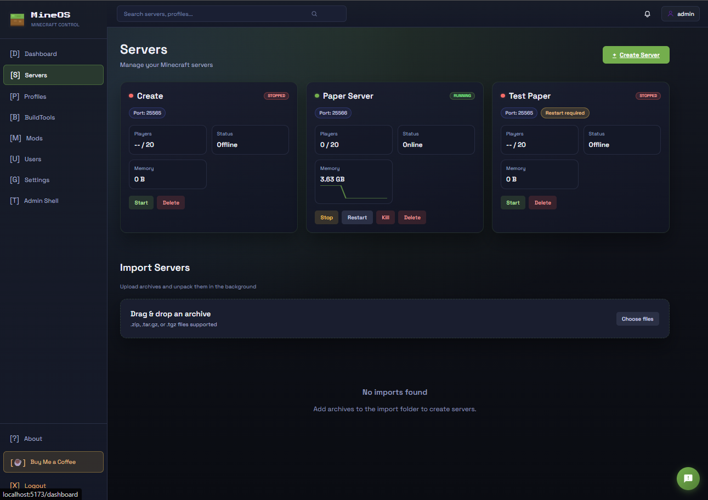
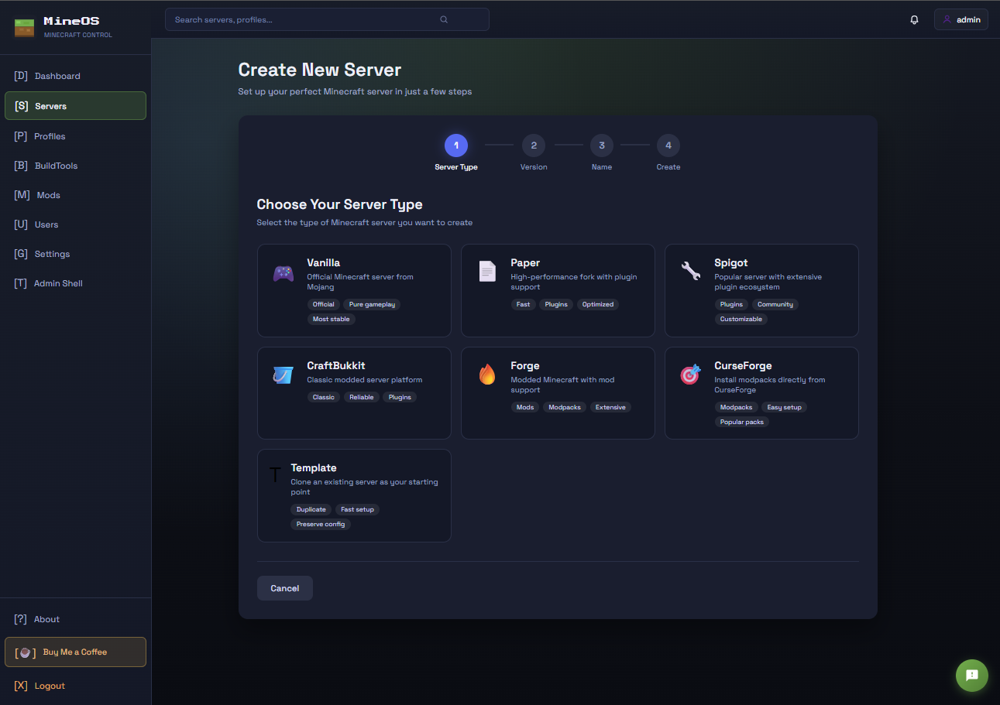
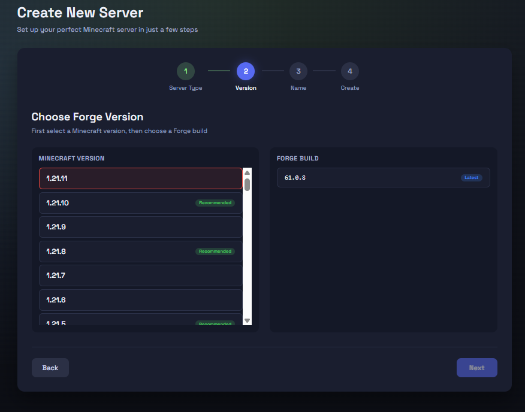
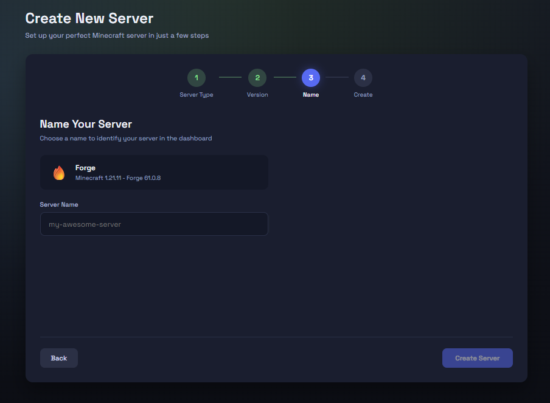
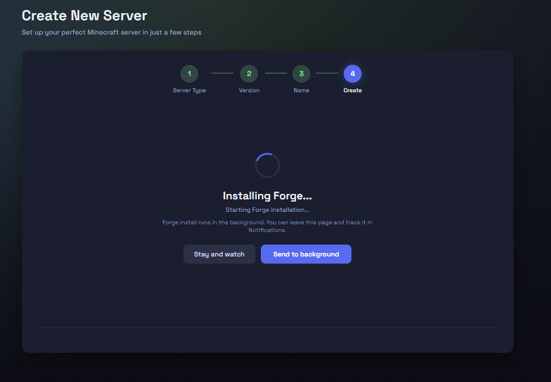
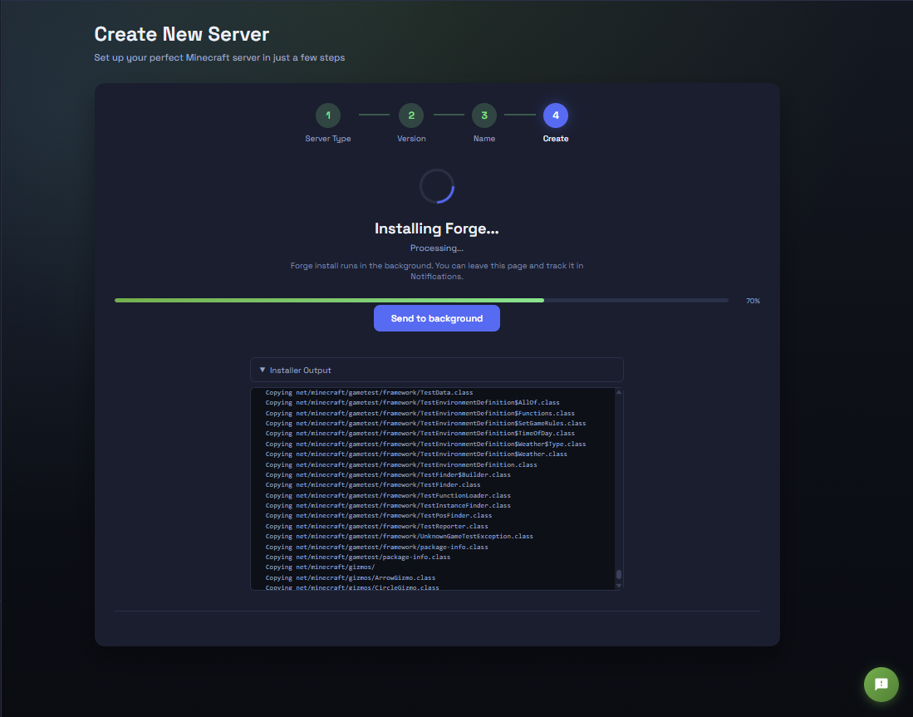
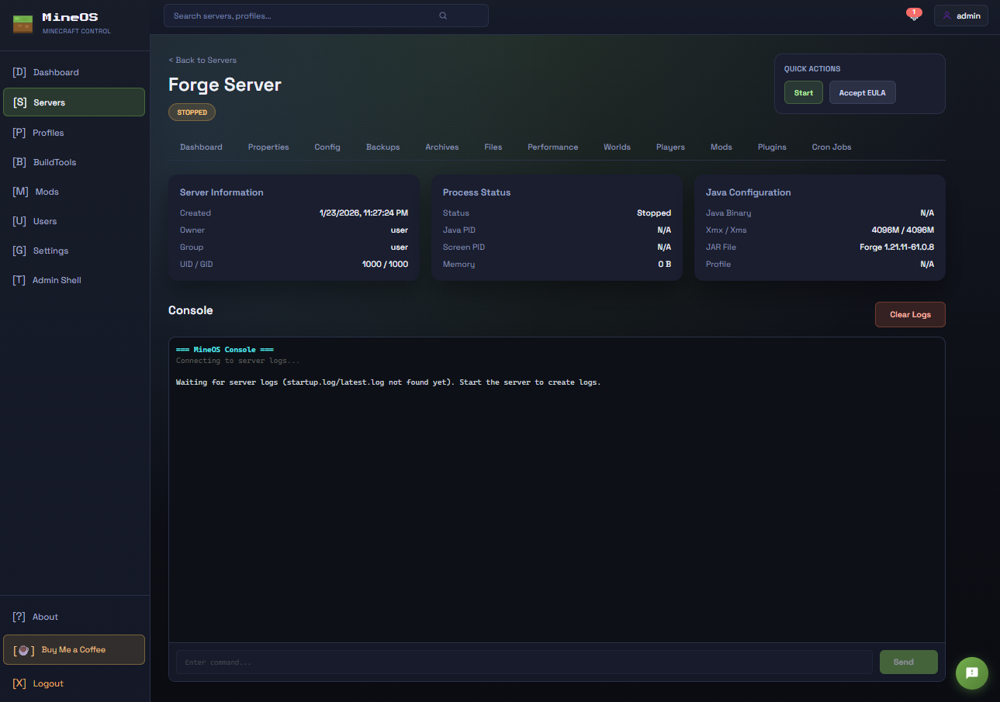

# MineOS - Minecraft Server Manager

A simple web interface to create and manage Minecraft servers. Run as many servers as you want, install mods with one click, and manage everything from your browser.

## Features

**Servers**
- Create Vanilla, Paper, Spigot, Forge, NeoForge, Fabric, Quilt and Bedrock servers from a guided wizard
- Start/stop/restart, live console, file manager, worlds, players, backups and archives
- Live status, players, memory and TPS, with per-server performance charts
- Scheduled tasks (cron), server icons, and changing a server's type after the fact
- Update detection with one-click updates (backup + rollback kept) for Vanilla, Paper, Bedrock, Velocity and BungeeCord

**Proxies / networks**
- Run a Velocity or BungeeCord proxy players connect to, with your game servers attached behind it
- Attach a server to a proxy from the create wizard, or from the Proxies page at any time
- Every backend reports a live security status — Secured, Securable, Misconfigured or Unverifiable — so you can see which servers a proxy can actually vouch for, and secure them in one click

**Mods and plugins**
- Browse and install from Modrinth and CurseForge, with dependency resolution
- Per-mod enable/disable, loader version upgrades, and client modpack (`.mrpack`) generation

**Administration**
- Multiple users with roles and per-server access control
- Import existing servers, host metrics, and a `mineos` CLI with a terminal UI

## Quick Install

**What you need:**
- [Docker Desktop](https://www.docker.com/products/docker-desktop) (Windows/Mac) or Docker + Docker Compose (Linux)
- That's it!

### Automatic Installation (Recommended)

**Linux/macOS:**
```bash
curl -fsSL https://mineos.net/install.sh | bash
```

**Windows (PowerShell):**
```powershell
iwr https://mineos.net/install.ps1 -useb | iex
```

The installer will:
- Check Docker + Docker Compose
- Create all necessary files and folders
- Configure environment settings
- Start MineOS automatically

**Access MineOS:** Open [http://localhost:3000](http://localhost:3000) on the machine running MineOS — or from any other device on your network using that machine's IP or hostname (e.g. `http://192.168.1.50:3000`). Any address works; no extra configuration needed.

> Getting a **403 on login** or can't connect? See the [Troubleshooting guide](docs/TROUBLESHOOTING.md).

### Manual Installation

If you prefer to install manually or need offline installation:

1. **Download the install bundle** from the [latest GitHub release](https://github.com/freeman412/mineos-sveltekit/releases/latest):
   - `mineos-install-bundle.tar.gz` (Linux/macOS)
   - `mineos-install-bundle.zip` (Windows)

2. **Extract the bundle:**
   ```bash
   # Linux/macOS
   tar -xzf mineos-install-bundle.tar.gz
   cd mineos

   # Windows (PowerShell)
   Expand-Archive mineos-install-bundle.zip -DestinationPath mineos
   cd mineos
   ```

3. **Configure environment:**
   ```bash
   cp .env.template .env
   # Edit .env with your preferred settings
   ```

4. **Start MineOS:**
   ```bash
   docker compose up -d
   ```

5. **Access MineOS:** Open [http://localhost:3000](http://localhost:3000) — or use this machine's IP/hostname from any other device (e.g. `http://192.168.1.50:3000`)

## Management

Use the `mineos` CLI tool to manage your installation:

```bash
mineos status      # Check service status
mineos stop        # Stop all services
mineos start       # Start all services
mineos restart     # Restart all services
mineos logs        # View logs
mineos update      # Update to latest version
```

The CLI is automatically installed during setup.

## That's It!

MineOS will start automatically whenever Docker starts. Create servers, install mods, and manage everything from the web interface.

## Uninstall

```bash
mineos uninstall
```

The uninstall will ask if you want to keep your server data before removing anything.

## Where Are My Files?

- **Server data:** `./minecraft/` folder (all your Minecraft servers)
- **Database:** `./data/mineos.db` (MineOS settings)

## Troubleshooting

**Need to change ports?**
Edit `.env` and run `docker compose restart`

**Want Minecraft LAN discovery?**
Re-run the installer and enable **host networking** when prompted. This is Linux-only and disables Docker network isolation (containers bind directly to `API_PORT`/`WEB_PORT` on the host). The installer automatically configures `docker-compose.host.yml` when needed.

**Docker not found?**
Make sure Docker Desktop (Windows/Mac) or Docker + Docker Compose (Linux) is installed and running before installing MineOS.

## Screenshots














